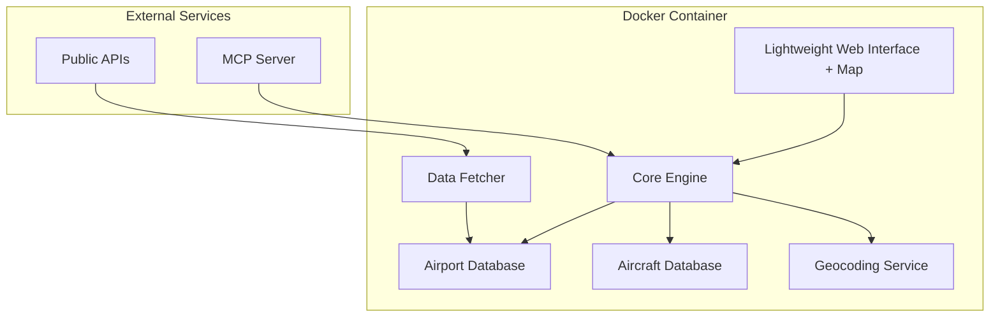

# Design Document

## Overview

The Emergency Airport Finder is a Python-based system that provides real-time emergency airport recommendations for pilots. The system consists of a core airport matching engine, a data management layer for airport information, an MCP server for external integrations, and a simple web interface. The architecture prioritizes speed, reliability, and ease of use during emergency situations.

## Architecture



The system follows a containerized architecture:
- **Presentation Layer**: Ultra-lightweight web interface with interactive map visualization
- **Business Logic Layer**: Core airport matching and filtering logic
- **Data Layer**: Local DuckDB database with cached airport and aircraft data
- **Integration Layer**: External API clients for data fetching and geocoding
- **Deployment**: Single Docker container with all components

## Components and Interfaces

### 1. Core Engine (`core/engine.py`)

The main business logic component that orchestrates airport finding operations.

**Key Classes:**
- `EmergencyAirportFinder`: Main service class
- `LocationResolver`: Handles GPS, city, and postal code inputs
- `AirportMatcher`: Filters airports based on aircraft compatibility
- `DistanceCalculator`: Computes great circle distances and bearings

**Key Methods:**
```python
class EmergencyAirportFinder:
    def find_emergency_airports(
        self, 
        location: Union[Coordinates, str], 
        aircraft_type: str,
        max_distance_nm: int = 100
    ) -> List[AirportRecommendation]
    
    def get_aircraft_requirements(self, aircraft_type: str) -> AircraftSpecs
    
    def validate_airport_compatibility(
        self, 
        airport: Airport, 
        aircraft: AircraftSpecs
    ) -> bool
```

### 2. Data Management (`data/`)

Handles all data persistence and retrieval operations.

**Components:**
- `database.py`: DuckDB database operations
- `airport_fetcher.py`: Fetches data from public APIs
- `models.py`: Data models for airports, aircraft, and recommendations

**Database Schema:**
```sql
-- Airports table
CREATE TABLE airports (
    icao_code TEXT PRIMARY KEY,
    name TEXT NOT NULL,
    latitude REAL NOT NULL,
    longitude REAL NOT NULL,
    elevation_ft INTEGER,
    longest_runway_ft INTEGER,
    runway_width_ft INTEGER,
    surface_type TEXT,
    weight_capacity_lbs INTEGER,
    last_updated TIMESTAMP
);

-- Aircraft specifications table
CREATE TABLE aircraft_specs (
    aircraft_type TEXT PRIMARY KEY,
    min_runway_length_ft INTEGER NOT NULL,
    min_runway_width_ft INTEGER NOT NULL,
    max_weight_lbs INTEGER NOT NULL,
    approach_speed_kts INTEGER
);
```

### 3. MCP Server (`mcp/server.py`)

Provides Model Context Protocol interface for LLM integration.

**MCP Tools Exposed:**
- `find_emergency_airports`: Main airport finding functionality
- `get_airport_details`: Detailed information about specific airports
- `validate_aircraft_compatibility`: Check if aircraft can use specific airport
- `get_supported_aircraft`: List all supported aircraft types

**Example MCP Tool Definition:**
```python
@mcp_tool("find_emergency_airports")
def find_emergency_airports_tool(
    location: str,
    aircraft_type: str,
    max_distance: int = 100
) -> dict:
    """Find suitable emergency airports for the given aircraft and location."""
    # Implementation details
```

### 4. Lightweight Web Interface (`web/`)

Ultra-lightweight FastAPI-based web interface with interactive map visualization.

**Features:**
- Single-page application with minimal JavaScript
- Interactive map using Leaflet.js (lightweight mapping library)
- Real-time airport visualization with color coding:
  - **Green markers**: Compatible airports for the aircraft
  - **Red markers**: Incompatible airports (too short runway, etc.)
  - **Blue plane icon**: Current aircraft position
- Distance circles showing search radius
- Popup details for each airport (runway specs, distance, bearing)

**Routes:**
- `/`: Main interface with embedded map
- `/api/search`: REST API endpoint for airport search
- `/api/aircraft`: List supported aircraft types
- `/health`: System health check

**Map Implementation:**
- Leaflet.js for lightweight mapping (38KB gzipped)
- OpenStreetMap tiles (free, no API key required)
- Custom markers for airports and aircraft
- Responsive design for mobile devices

### 5. External Integrations (`integrations/`)

Handles communication with external services.

**Services:**
- `ourairports_client.py`: Fetches airport data from OurAirports.com
- `geocoding_client.py`: Converts addresses to coordinates using OpenStreetMap Nominatim
- `aviation_weather_client.py`: Optional weather data integration

## Data Models

### Airport Model
```python
@dataclass
class Airport:
    icao_code: str
    name: str
    coordinates: Coordinates
    elevation_ft: int
    longest_runway_ft: int
    runway_width_ft: int
    surface_type: str
    weight_capacity_lbs: Optional[int]
    contact_info: Optional[str]
```

### Aircraft Specifications Model
```python
@dataclass
class AircraftSpecs:
    aircraft_type: str
    min_runway_length_ft: int
    min_runway_width_ft: int
    max_weight_lbs: int
    approach_speed_kts: int
    category: str  # "light", "medium", "heavy", "super"
```

### Airport Recommendation Model
```python
@dataclass
class AirportRecommendation:
    airport: Airport
    distance_nm: float
    bearing_degrees: float
    compatibility_score: float
    warnings: List[str]
    estimated_flight_time_minutes: Optional[int]
```

## Error Handling

The system implements comprehensive error handling:

1. **Data Validation Errors**: Invalid coordinates, unknown aircraft types
2. **External Service Errors**: API timeouts, rate limiting, network issues
3. **Database Errors**: Corruption, disk space, connection issues
4. **Business Logic Errors**: No suitable airports found, invalid search parameters

**Error Response Format:**
```python
@dataclass
class ErrorResponse:
    error_code: str
    message: str
    details: Optional[dict]
    suggestions: List[str]
```

**Error Handling Strategy:**
- Graceful degradation: Use cached data when external services fail
- User-friendly messages: Convert technical errors to actionable guidance
- Logging: Comprehensive logging for debugging and monitoring
- Fallback options: Expand search radius or relax constraints when no results found

## Testing Strategy

### Unit Tests
- Core logic components (distance calculations, airport filtering)
- Data models and validation
- External API clients with mocked responses
- Database operations with test database

### Integration Tests
- End-to-end airport finding workflows
- MCP server functionality
- Web interface API endpoints
- Data fetching and caching processes

### Performance Tests
- Response time under various load conditions
- Database query performance with large datasets
- Memory usage during bulk operations
- Concurrent request handling

### Test Data
- Sample airport database with known test cases
- Mock aircraft specifications for various aircraft types
- Test coordinates for major cities and remote locations
- Edge cases: airports at extreme latitudes, very short runways

## Performance Considerations

1. **Database Indexing**: Spatial indexes on coordinates for fast proximity searches
2. **Caching Strategy**: In-memory cache for frequently accessed aircraft specs
3. **Query Optimization**: Pre-computed distance matrices for common routes
4. **Async Operations**: Non-blocking external API calls where possible

## Security Considerations

1. **Input Validation**: Sanitize all user inputs to prevent injection attacks
2. **Rate Limiting**: Prevent abuse of external APIs and system resources
3. **Data Privacy**: No storage of user location data beyond session scope
4. **API Security**: Secure MCP server endpoints with appropriate authentication

## Deployment Architecture

The system is designed as a single Docker container for maximum portability:

1. **Docker Container**: Single container with Python FastAPI app, DuckDB database, and static assets
2. **Port Mapping**: Exposes port 5000 for web interface and port 8080 for MCP server
3. **Volume Mounting**: Optional volume for persistent airport data cache
4. **Environment Variables**: Configuration through environment variables
5. **Offline Capability**: Full functionality with pre-cached data in container

**Docker Structure:**
```dockerfile
FROM python:3.11-slim
WORKDIR /app
COPY requirements.txt .
RUN pip install -r requirements.txt
COPY . .
EXPOSE 5000 8080
CMD ["python", "app.py"]
```

## Data Sources

### Primary Airport Data
- **OurAirports.com**: Comprehensive global airport database
- **FAA Airport Data**: US airport specifications and runway details
- **ICAO Airport Codes**: International airport identification

### Aircraft Specifications
- **Built-in Database**: Curated list of common aircraft with runway requirements
- **User Input**: Manual specification for uncommon aircraft types
- **Aviation Databases**: Integration with aircraft specification APIs

## Future Enhancements

1. **Weather Integration**: Real-time weather conditions at recommended airports
2. **NOTAM Integration**: Notice to Airmen for airport closures or restrictions
3. **Fuel Availability**: Information about fuel services at airports
4. **Mobile App**: Native mobile application for pilots
5. **Flight Planning**: Integration with flight planning software
6. **Multi-language Support**: Interface localization for international use