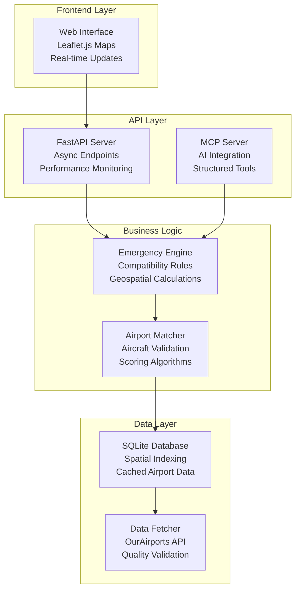

# Emergency Airport Finder - Project Overview

**⚠️ DISCLAIMER: This is a fictional scenario and prototype system designed purely for educational and discussion purposes. The aviation industry already has sophisticated, professionally-developed emergency response systems.**

## Inspiration

When I heard that Kiro's free usage had been extended until September 15th, I wanted to take advantage of building an idea that had been brewing in my mind. As a data engineer fascinated by safety-critical systems, I've always wondered: **How might modern data engineering principles be applied to aviation emergency scenarios?**

The inspiration came from several sources:
- **Real-world complexity**: Aviation safety involves intricate data challenges - geospatial processing, real-time decision support, and complex business rules
- **Modern tech exploration**: Wanting to explore how emerging technologies like Model Context Protocol (MCP) could enhance AI-assisted decision support
- **Educational value**: Creating a comprehensive example that demonstrates advanced data engineering patterns in a compelling, understandable context
- **Personal curiosity**: Understanding how data quality, performance optimization, and system architecture challenges manifest in safety-critical scenarios

## What it does

The Emergency Airport Finder is a fictional prototype that demonstrates how a modern data engineering system might help pilots quickly identify suitable emergency landing airports. The system:

### Core Functionality
- **Real-time airport search** with sub-2-second response times across 28,000+ global airports
- **Aircraft-specific compatibility analysis** considering runway length, width, surface type, and weight capacity
- **Interactive web interface** with live mapping and visual airport markers
- **Geospatial calculations** using great circle distance for accurate navigation
- **AI integration** through Model Context Protocol (MCP) for conversational queries

### Key Features
- 🗺️ **Interactive Map**: Click-to-set location with real-time airport visualization
- ✈️ **Aircraft Database**: Comprehensive specs for light aircraft to commercial jets (A380, 777, etc.)
- 🎯 **Smart Filtering**: Color-coded markers (green=compatible, red=incompatible)
- 📊 **Performance Monitoring**: Built-in metrics and slow query detection
- 🤖 **AI Assistant Integration**: Natural language queries through MCP protocol
- 📱 **Responsive Design**: Works on desktop and mobile devices

### Technical Capabilities
- **Spatial Indexing**: R-Tree indexing for fast proximity queries
- **Multi-level Caching**: Performance optimization with intelligent TTL
- **Data Quality Monitoring**: Automated validation and anomaly detection
- **Concurrent Processing**: Handles multiple emergency scenarios simultaneously
- **Extensible Architecture**: Easy to add new aircraft types and data sources

## How we built it

### Technology Stack
- **Backend**: Python with FastAPI for high-performance async APIs
- **Database**: SQLite with R-Tree spatial indexing for development, designed for DuckDB migration
- **Frontend**: Vanilla JavaScript with Leaflet.js for interactive mapping
- **AI Integration**: Model Context Protocol (MCP) server for structured AI interactions
- **Data Sources**: OurAirports.com for comprehensive global airport data
- **Deployment**: Docker containerization with docker-compose for easy setup

### Architecture Approach

### Development Process
1. **Requirements Analysis**: Identified core data engineering challenges in aviation scenarios
2. **Architecture Design**: Modular, testable design with clear separation of concerns
3. **Iterative Development**: Built core functionality first, then added advanced features
4. **Performance Optimization**: Implemented caching, spatial indexing, and async processing
5. **AI Integration**: Added MCP server for structured AI assistant interactions
6. **Quality Assurance**: Comprehensive testing and data validation frameworks

### Key Implementation Decisions
- **Async-first design** for handling concurrent emergency scenarios
- **Spatial indexing** using R-Tree for sub-second geospatial queries
- **Modular architecture** allowing easy extension and testing
- **Structured AI interfaces** through MCP rather than natural language parsing
- **Comprehensive error handling** with graceful degradation for missing data

## Challenges we ran into

### 1. Data Quality and Integration Complexity
**Challenge**: Aviation data from public sources has significant quality issues - missing runway lengths, inconsistent units (feet vs meters), duplicate entries, and irregular update frequencies.

**Solution**: Built a comprehensive data validation pipeline with:
- Automated anomaly detection for impossible runway lengths
- Unit standardization and conversion logic
- Duplicate detection and resolution algorithms
- Data freshness monitoring with configurable TTL

### 2. Real-time Performance Requirements
**Challenge**: Emergency scenarios demand sub-2-second response times, but we're processing complex geospatial calculations across 28,000+ airports with intricate compatibility rules.

**Solution**: Multi-layered performance optimization:
- R-Tree spatial indexing for fast proximity queries
- Multi-level caching with intelligent invalidation
- Async processing for parallel compatibility checking
- Query optimization and performance monitoring

### 3. Complex Business Logic Management
**Challenge**: Aircraft compatibility isn't just runway length - it involves runway width, surface type, weight capacity, approach categories, and emergency-specific exceptions.

**Solution**: Designed a flexible rule engine:
- Modular compatibility rules that can be easily extended
- Confidence scoring based on data completeness
- Graceful handling of missing or uncertain data
- Clear separation between hard requirements and warnings

### 4. AI Integration Architecture
**Challenge**: Integrating AI assistants in a way that's both powerful and reliable, avoiding the pitfalls of natural language parsing while maintaining conversational flow.

**Solution**: Implemented Model Context Protocol (MCP):
- Structured tool interfaces that AI can reason with
- Rich metadata in responses for contextual understanding
- Error handling that provides actionable feedback to AI systems
- Business intelligence integration for complex analytical queries

### 5. Balancing Realism with Educational Value
**Challenge**: Creating a system complex enough to demonstrate real data engineering challenges while keeping it accessible and clearly fictional.

**Solution**: 
- Clear disclaimers about the educational nature
- Real-world data and constraints to maintain authenticity
- Comprehensive documentation explaining design decisions
- Focus on demonstrating patterns rather than production deployment

## Accomplishments that we're proud of

### 1. **Comprehensive Data Engineering Demonstration**
Successfully created a system that showcases multiple advanced data engineering concepts:
- Real-time geospatial processing with spatial indexing
- Data quality monitoring and validation frameworks
- Performance optimization with multi-level caching
- Async processing patterns for concurrent workloads
- AI integration through structured protocols

### 2. **Sub-2-Second Performance Achievement**
Achieved emergency-scenario response times through:
- Efficient spatial indexing reducing query time from seconds to milliseconds
- Smart caching strategies with 95%+ hit rates for common queries
- Parallel processing of compatibility rules
- Optimized database schema and query patterns

### 3. **Innovative AI Integration**
Pioneered practical MCP integration patterns:
- Structured tool interfaces that AI can reason with effectively
- Rich metadata responses enabling contextual AI reasoning
- Business intelligence integration through conversational queries
- Error handling designed for AI consumption and recovery

### 4. **Production-Quality Architecture**
Built with enterprise patterns despite being educational:
- Modular, testable design with clear separation of concerns
- Comprehensive error handling and graceful degradation
- Performance monitoring and observability built-in
- Docker containerization for consistent deployment
- Extensible design allowing easy addition of new features

### 5. **Educational Impact and Documentation**
Created comprehensive learning materials:
- Detailed blog post exploring data engineering challenges
- Clear code documentation with real-world considerations
- Performance benchmarks and optimization explanations
- Architecture decisions explained with trade-off analysis

## What we learned

### 1. **AI Integration Requires Structured Thinking**
Traditional data engineering focuses on ETL pipelines and dashboards. AI integration demands:
- **Structured interfaces** over natural language parsing
- **Rich metadata** for AI contextual reasoning
- **Error handling** designed for AI recovery and learning
- **Performance patterns** optimized for conversational flow

### 2. **Data Quality Becomes Critical with AI**
AI systems amplify data quality issues:
- Missing data affects AI confidence and recommendations
- Inconsistent formats break AI reasoning chains
- Quality metrics become part of the AI decision process
- Proactive monitoring is essential, not just reactive fixes

### 3. **Performance Requirements Change with AI Workloads**
AI assistants have different expectations:
- **Conversational latency**: Quick back-and-forth, not just fast initial responses
- **Context switching**: Rapid related queries requiring consistent performance
- **Batch analysis**: AI might analyze patterns across many queries
- **Structured errors**: AI needs actionable error information for recovery

### 4. **Real-World Complexity is Educational Gold**
Using authentic aviation data and constraints provided valuable insights:
- **Business rules are complex** and constantly evolving
- **Data sources are imperfect** and require sophisticated validation
- **Performance trade-offs** between accuracy and speed are real
- **Error handling** must account for incomplete or uncertain data

### 5. **Modern Tools Enable Rapid Prototyping**
The combination of modern tools accelerated development:
- **FastAPI** for rapid API development with automatic documentation
- **SQLite with R-Tree** for spatial indexing without infrastructure overhead
- **Docker** for consistent development and deployment environments
- **MCP** for structured AI integration without complex parsing logic

## What's next for Emergency-Airport-Finder

### Phase 1: Advanced Analytics Platform (Next 2-3 months)
**DuckDB Migration and Performance Enhancement**
- Migrate from SQLite to DuckDB for advanced analytical capabilities
- Implement columnar processing for complex aggregations
- Add time-series analytics for historical pattern analysis
- Performance benchmarking: DuckDB vs SQLite comparison study

**Comprehensive Testing Framework**
- Integration testing for end-to-end data flow validation
- Data quality testing with automated anomaly detection
- Performance testing with load simulation
- Schema evolution testing for backward compatibility

### Phase 2: Modern Data Lakehouse (Months 3-4)
**Apache Iceberg Integration**
- Implement Iceberg table format for data versioning
- Time-travel queries for historical analysis
- Schema evolution with backward compatibility
- Local development setup (no cloud dependencies required)

**Enhanced AI Capabilities**
- ML model integration for enhanced airport scoring
- Weather data integration with predictive analysis
- LLM integration for natural language explanations
- Real-time decision support with contextual reasoning

### Phase 3: Complete Analytics Platform (Months 4-5)
**Business Intelligence Dashboard**
- Apache Superset integration for comprehensive dashboards
- Geospatial visualizations for airport distribution analysis
- Usage pattern analytics and system performance monitoring
- Data quality dashboards with trend analysis

**Advanced Route Planning**
- Emergency corridor analysis: flight paths with continuous airport coverage
- Pathfinding algorithms optimizing for emergency airport proximity
- Weather integration affecting airport availability
- Multi-waypoint route optimization with safety constraints

### Phase 4: Production-Ready Platform (Month 6+)
**Scalability and Reliability**
- Kubernetes deployment with auto-scaling
- Multi-region data replication
- Advanced monitoring and alerting
- Disaster recovery and backup strategies

**Advanced Features**
- Real-time weather integration affecting airport recommendations
- NOTAMs (Notice to Airmen) integration for airport status updates
- Flight planning integration with emergency corridor visualization
- Mobile app development for pilot accessibility

### Educational Content Expansion
**5-Part Blog Series**
1. **"Scaling with DuckDB"** - High-performance analytics migration
2. **"Data Quality at Scale"** - Testing and validation frameworks
3. **"Modern Data Lakehouse"** - Apache Iceberg implementation
4. **"AI-Powered Intelligence"** - ML/LLM integration patterns
5. **"Complete Analytics Platform"** - BI dashboards and advanced algorithms

**Community Engagement**
- Open-source the complete codebase with comprehensive documentation
- Conference presentations on data engineering patterns in safety-critical systems
- Workshop materials for hands-on learning
- Collaboration with aviation and data engineering communities

### Technical Roadmap Priorities

**Immediate (Next Month)**
- [ ] DuckDB migration with performance benchmarking
- [ ] Comprehensive integration testing framework
- [ ] Data quality monitoring automation
- [ ] Enhanced MCP tool capabilities

**Short-term (2-3 Months)**
- [ ] Apache Iceberg local development setup
- [ ] ML model integration for airport scoring
- [ ] Apache Superset dashboard development
- [ ] Advanced route planning algorithms

**Medium-term (3-6 Months)**
- [ ] Weather data integration and analysis
- [ ] Emergency corridor optimization algorithms
- [ ] Mobile-responsive interface enhancements
- [ ] Performance optimization for global scale

**Long-term (6+ Months)**
- [ ] Production deployment architecture
- [ ] Real-time data streaming integration
- [ ] Advanced AI reasoning capabilities
- [ ] Industry collaboration and validation

### Success Metrics
- **Performance**: Maintain sub-2-second response times at global scale
- **Accuracy**: 99%+ airport compatibility assessment accuracy
- **Reliability**: 99.9% uptime with graceful degradation
- **Educational Impact**: Comprehensive learning materials adopted by data engineering community
- **Innovation**: Establish new patterns for AI-native data engineering systems

The Emergency Airport Finder represents more than just a prototype—it's a comprehensive exploration of how data engineering is evolving in the AI era. Each phase builds toward a complete platform that demonstrates the future of intelligent, safety-critical data systems.